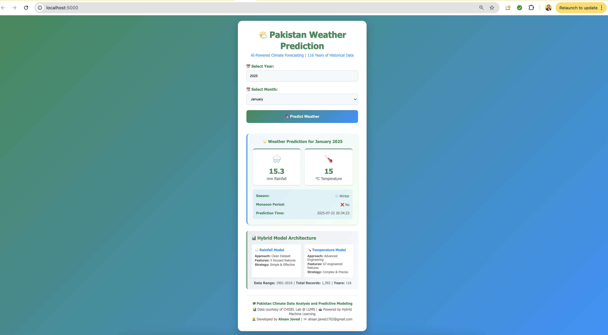

# Pakistan Climate Prediction System: Advanced ML for Flood Risk Analysis

A production-grade ML system predicting rainfall and temperature patterns in Pakistan using 116 years of historical data (1901-2016) to support flood risk assessment during critical monsoon periods.

**Key Achievement**: R² = 0.992 for temperature, R² = 0.716 for rainfall prediction.

## Quick Start

### Docker (Recommended)
```bash
docker build -t pakistan-climate-engine .
docker run -p 8000:8000 pakistan-climate-engine
```

### Local Python
```bash
pip install -r requirements.txt
uvicorn fastapi_app:app --reload
```

## API Usage

Access interactive docs at: `http://localhost:8000/docs`

**Endpoint**: `/predict` (POST)

**Request:**
```
{
  "year": 2025,
  "month": 7
}
```

**Response:**
```
{
  "year": 2025,
  "month": "July",
  "rainfall": 56.6,
  "temperature": 28.9,
  "season": "Summer",
  "is_monsoon": true,
  "success": true,
  "method": "pipeline"
}
```

## Project Context & Significance

### Pakistan's Flood Challenge
Pakistan faces devastating floods during July-August monsoon seasons. This system provides:
- Early warning for flood-prone regions
- Agricultural planning support
- Water resource management
- Emergency preparedness


## Technical Architecture

### Production Features
- **FastAPI**: Asynchronous inference with auto-generated docs
- **Docker**: Fully containerized for reproducibility
- **CI/CD**: GitHub Actions for automated testing
- **Error Handling**: Smart fallback to heuristic models
- **Type Safety**: Pydantic validation

### Hybrid Modeling Strategy
- **Temperature**: Advanced 67-feature engineering (R² = 0.992)
- **Rainfall**: Optimized simple approach (R² = 0.716)

### Algorithm Portfolio
- Linear/Ridge Regression, Random Forest
- Gradient Boosting, XGBoost
- Support Vector Regression

## Model Performance

| Target Variable | Model Architecture | Performance |
|---|---|---|
| Rainfall | Gradient Boosting Regressor | See Notebook |
| Temperature | LightGBM / Random Forest | See Notebook |

## Data Visualization & Analysis

### Flood Risk Analysis


### Model Evaluation


### Data Visualization


## Deployment Options

### 1. FastAPI (Recommended)
Production-ready API with MLOps pipeline

### 2. Streamlit Application
Interactive web interface for real-time predictions
[📹 Watch Demo Video](media-assets/videos/streamlit_app.mov)

### 3. Flask Web Service
RESTful API with batch processing capabilities


## Project Structure

```
pakistan_temp_rainfall_predictive_modelling/
├── .github/workflows/           # CI/CD Pipeline
├── Flask_app/                   # Flask API service
├── Streamlit_app/              # Streamlit interface
├── media-assets/               # Images and videos
├── research/                   # Jupyter notebooks & analysis
├── fastapi_app.py             # Main API entry point
├── Dockerfile                 # Container configuration
├── requirements.txt           # Dependencies
└── *.joblib                   # Trained models
```

## System Limitations

- **Temporal Range**: Data limited to 1901-2016
- **Spatial Resolution**: National averages only
- **Climate Change**: Recent shifts may not be captured

## Future Enhancements

- Deep Learning integration (LSTM networks)
- Regional province-level models
- Real-time weather API integration
- Mobile-responsive interface

## Data Source & Contact

**Data**: CHISEL @ LUMS [Center for Climate Research](https://opendata.com.pk/organization/chisel)
**Analysis Period**: 1901-2016 Pakistan Climate Dataset

**Author**: Ahsan Javed - Data Scientist & ML Engineer
- **LinkedIn**: [Ahsan Javed](https://www.linkedin.com/in/ahsan-javed17)
- **Email**: ahsan.javed1702@gmail.com

---

**Disclaimer**: For critical flood management decisions, integrate with official meteorological services and consider model limitations.
